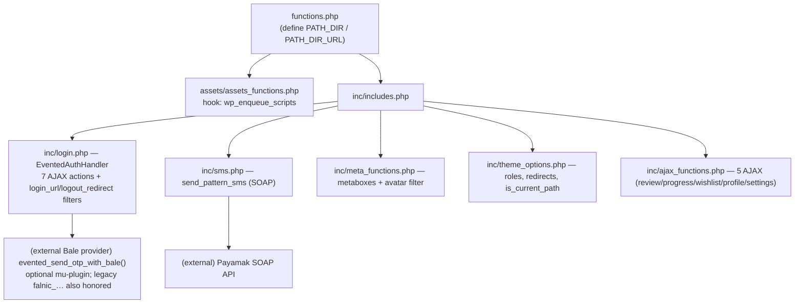
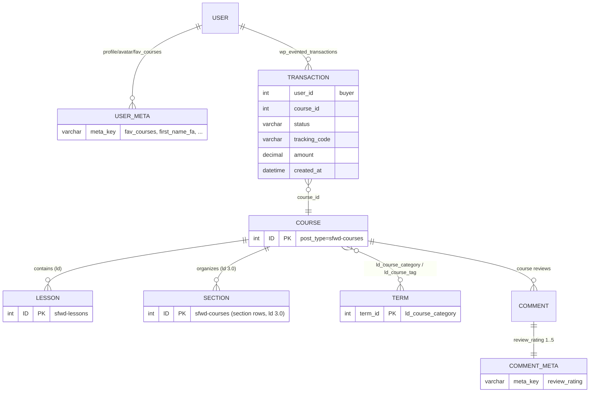
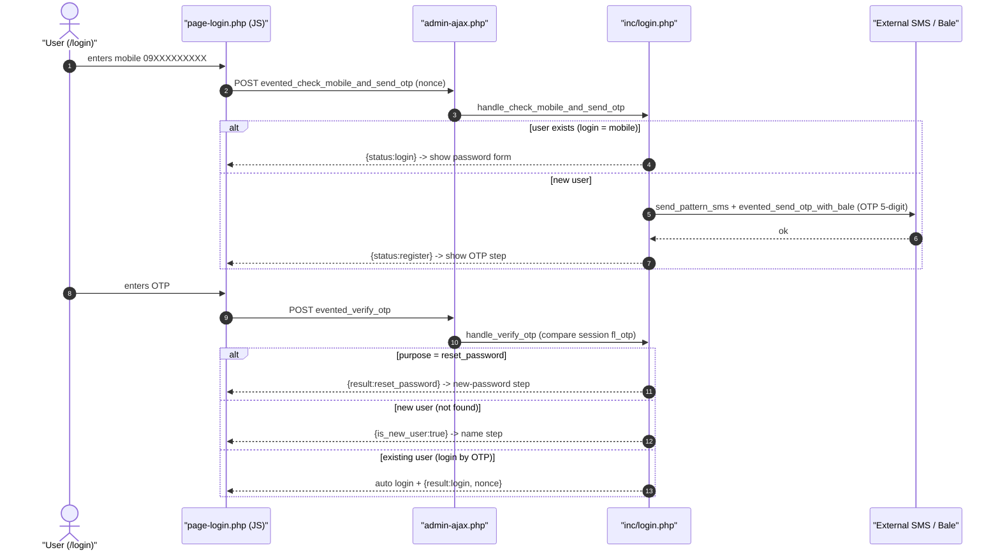
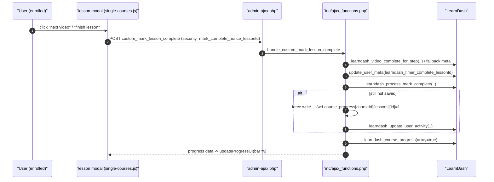
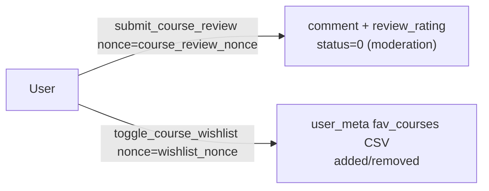
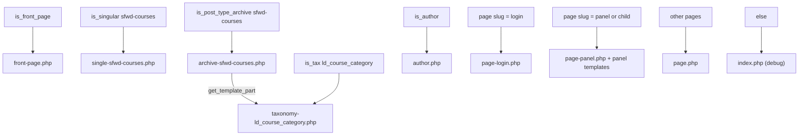
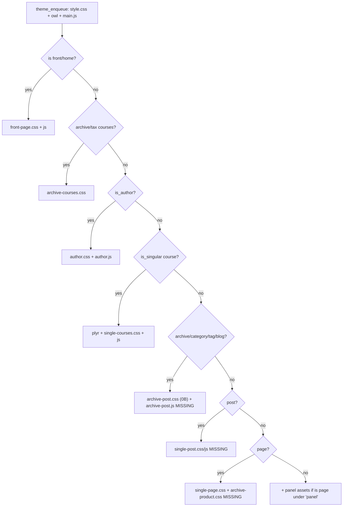

# ARCHITECTURE — معماری قالب «evented-edu»

این سند معماری نرم‌افزار، الگوهای استفاده‌شده، جریان داده، ساختار پایگاه‌داده و قراردادهای AJAX را شرح می‌دهد. همهٔ دیاگرام‌ها با **سینتکس Mermaid.js** نوشته شده‌اند تا مستقیماً توسط انسان و مدل‌های AI قابل درک باشند.

---

## ۱. نمای کلی لایه‌ها

| لایه | مسیر | مسئولیت |
|---|---|---|
| **Presentation (Templates)** | ریشهٔ قالب + `panel/` | رندر HTML/RTL صفحات |
| **Logic (inc)** | `inc/*.php` | احراز هویت، پیامک، متاباکس‌ها، AJAX، تنظیمات |
| **Assets** | `assets/` + `assets/assets_functions.php` | CSS/JS/فونت و بارگذاری شرطی |
| **Integration** | خارج از قالب | LearnDash، درگاه پرداخت، جدول تراکنش، سرویس پیامک/بله |

الگوی کلی: **WP Theme + MVC-lite** — قالب‌ها = View، `inc/*` = Controller/Service، وردپرس/لرن‌دش = Model/DB. هیچ فریم‌ورک یا autoloader/PHP مودرن (namespace) استفاده نشده؛ کد به‌صورت توابع `evented_*` و کلاس‌های ساده نوشته شده است (پس از برندینگ، وارث نام‌های `falnic_*`).

## ۲. بوت‌استرپ و ترتیب بارگذاری



نکات:
- `EventedAuthHandler` با `add_action('init', fn => new EventedAuthHandler())` نمونه‌سازی می‌شود.
- `inc/captcha.php` و `captcha_verify()` (در login.php) فعلاً **به هیچ فرمی متصل نیستند** (کد مردهٔ آماده).
- هوک‌های ریدایرکت: `login_url` → `/login/` و `logout_redirect` → خانه (هر دو در `inc/login.php`)؛ `login_redirect` برای نقش subscriber → `/panel` (در `inc/theme_options.php`).

## ۳. ساختار پایگاه‌داده (Data Structures)

### ۳.۱ پست‌تایپ‌ها/تاکسونومی‌ها



### ۳.۲ جدول سفارشی `{wp}_evented_transactions`

قالب **فقط از این جدول می‌خواند** (صفحات `payments` و `dashboard`)؛ سازنده/درگاه خارج از قالب است.
ستون‌های استفاده‌شده در کد (مستخرج از `panel/payments.php` و `panel/dashboard.php`): `user_id`, `course_id`, `status` (مقادیر غیر از `success` = ناموفق), `tracking_code`, `amount`, `created_at`.

DDL پیشنهادی (سازگار با کد — در صورت نبودِ جدول در نصب):

```sql
CREATE TABLE IF NOT EXISTS {wp}_evented_transactions (
    id            BIGINT UNSIGNED NOT NULL AUTO_INCREMENT,
    user_id       BIGINT UNSIGNED NOT NULL DEFAULT 0,
    course_id     BIGINT UNSIGNED NOT NULL DEFAULT 0,
    status        VARCHAR(50)     NOT NULL DEFAULT '',
    tracking_code VARCHAR(190)    NOT NULL DEFAULT '',
    amount        DECIMAL(15,0)   NOT NULL DEFAULT 0,
    created_at    DATETIME        NOT NULL,
    PRIMARY KEY (id),
    KEY idx_user (user_id),
    KEY idx_status (status)
) ENGINE=InnoDB DEFAULT CHARSET=utf8mb4 COLLATE=utf8mb4_unicode_ci;
```

> ⚠️ در `panel/certificates.php` گارد مهمان به‌اشتباه به `/panel/payments.php` ریدایرکت می‌کند (رجوع: `TODO.md`).

### ۳.۳ کلیدهای متای دوره (`sfwd-courses`)

| کلید (post_meta) | نوع | معنا |
|---|---|---|
| `_course_subtitle` | textarea | زیرعنوان/خلاصهٔ Hero |
| `_total_duration` | string | مدت کل (نمایشی) |
| `_course_level` | select | مقدماتی/متوسط/پیشرفته |
| `_course_status` | select | در حال برگزاری/تمام‌شده |
| `_course_suffering` | `"0"/"1"` | فعال‌سازی باکس «آپلود تمرین» (فقط UI) |
| `_course_outcomes` | array | «آنچه می‌آموزید» (ریپیتر) |
| `_course_faq` | array | FAQ دوره `[{question, answer}]` |
| `_webinar_active` | `yes/no` | نمایش بخش وبینار |
| `_webinar_date` / `_webinar_time` / `_webinar_location` | string | جزئیات وبینار |
| `_webinar_map_iframe` | url | src نقشهٔ embed |
| `_webinar_gmap_link` / `_webinar_neshan_link` | url | لینک‌های مسیریابی |

### ۳.۴ کلیدهای لرن‌دش (خوانده‌شده در قالب)

| کلید/تابع | کاربرد |
|---|---|
| `_sfwd-courses` (متای آرایه‌ای) | `sfwd-courses_course_price`، `sfwd-courses_course_price_type`، `sfwd-courses_course_materials*` |
| `price_type` مقادیر | `open/free` → «رایگان»؛ بقیه → قیمت‌دار |
| `_learndash_course_grid_duration` (ثانیه) | مدت هر درس (کلید افزونهٔ Course Grid) |
| `learndash_get_setting(id,'sample_lesson')` | `on` = درس پیش‌نمایش (قفل ندارد) |
| `learndash_get_setting(id,'lesson_video_url')` | ویدیوی درس |
| `learndash_get_setting(id,'certificate')` | گواهینامهٔ دوره |
| `learndash_30_get_course_sections(id)` | سکشن‌ها (فصل‌ها) |

### ۳.۵ Term-Meta دسته (`ld_course_category`)

| کلید | محل نوشتن | معنا |
|---|---|---|
| `ld_cat_image_id` | پیشخوان دسته | آیدی تصویر دسته |
| `short_discription` | پیشخوان دسته (wp_editor) | متن هدر دسته |
| `ld_category_faqs` | پیشخوان دسته | `[{question, answer}]` (پایین آرشیو) |

### ۳.۶ User-Meta

| کلید | معنا |
|---|---|
| `fav_courses` | CSV از course_id (علاقه‌مندی) |
| `first_name_fa/last_name_fa/first_name_en/last_name_en` | نام برای پروفایل/گواهینامه |
| `gender`, `birth_date` | جنسیت، تولد (جلالی) |
| `billing_phone` | موبایل (استاندارد ووکامرس) |
| `custom_user_avatar` | آواتار سفارشی (جایگزین Gravatar با فیلتر) |
| `youtube/linkedin/instagram/about_teacher` | پروفایل مدرس |
| `teacher_jobs` / `teacher_education` | ریپیتر سوابق شغلی/تحصیلی |
| `instructor_user_role` | نقش نمایشی مدرس |
| `instructor_rating_average` | میانگین امتیاز (فقط خوانده می‌شود) |

### ۳.۷ Session و Transient (جریان OTP)

| کلید | معنا |
|---|---|
| سشن: `fl_otp` / `fl_mobile` / `fl_otp_time` / `fl_otp_purpose` / `fl_otp_verified` / `fl_otp_verified_for` | وضعیت OTP |
| سشن: `captcha_code` | (برای captcha — غیرفعال) |
| ترنزینت: `otp_limit_{mobile}` (۶۰ ثانیه) | محدودیت نرخ ارسال کد |

---

## ۴. جریان‌های اصلی (Data Flow)

### ۴.۱ احراز هویت با OTP



مسیرهای تکمیلی (خلاصه): ثبت‌نام نهایی = `save_user_register_name` (ساخت کاربر: login=موبایل، ایمیل `{mobile}@evented-edu.user`) سپس `evented_register_user` (ست رمز + لاگین). ورود با رمز = `evented_login_user`. بازیابی رمز = `evented_send_otp(purpose=reset_password)` → `evented_verify_otp` → `evented_reset_password`.

> ✅ این دو «خط طلایی» رفع شده‌اند: `save_user_register_name` فقط با OTP تأییدشدهٔ همان شماره کاربر می‌سازد و `handle_register_user` با `$user->ID` (نه خروجی void تابع `wp_set_password`) لاگین خودکار را انجام می‌دهد.

### ۴.۲ تکمیل درس (دور زدن قفل ویدیو/تایمر)



### ۴.۳ نظر / علاقه‌مندی (کوتاه)



---

## ۵. نگاشت قالب‌ها (Template Map)



- **قوانین فعلی صفحهٔ دوره**: درس باز است اگر `sfwd_lms_has_access()` **یا** `sample_lesson === 'on'`؛ دکمه‌های «بعدی/تکمیل» بین `$unlocked_lessons` با شمارندهٔ «درس/پیش‌نمایش X از Y»؛ آخرین درس بدون دسترسی → کلیک روی `#start_course`.
- **سایدبار دوره**: کاربر دارای دسترسی → `learndash_course_progress` + دکمهٔ شروع/ادامه/مرور (و `learndash_course_get_resume_step_url`)؛ بدون دسترسی → قیمت + `learndash_payment_buttons()` (یا لینک ورود وقتی `price_type !== 'closed'`).
- **نظرات دوره**: همیشه فعال است (`$is_reviews_enabled = true;` در پایان شرط‌ها)؛ فقط کامنت‌های تاییدشده نمایش داده می‌شوند.

## ۶. بارگذاری Assets (Enqueue)



- `main.js` لوکال‌سازی: `ajax_object = {ajax_url, nonce}` — nonce مربوط به `notification_nonce` است و استفاده نمی‌شود؛ اسکریپت‌های واقعی nonce را از `data-nonce` می‌خوانند.
- پنل: `panel.css` + `jalalidatepicker.min.js` + `panel.js` وقتی برگه، خودِ `panel` یا زیرمجموعهٔ آن باشد.
- کتابخانه‌ها: Owl Carousel (سراسری)، Plyr (فقط single دوره)، Jalali Date Picker (پنل)، PhotoSwipe (enqueue نشده — بدون استفاده)، Font Awesome (یک آیکن در `author.php` بدون لودر!).

## ۷. قراردادهای AJAX (Inventory)

همهٔ درخواست‌ها به `admin-ajax.php` می‌روند. اسامی اکشن، nonce و سمت دسترسی:

| اکشن | nonce | دسترسی | سمت |
|---|---|---|---|
| `evented_check_mobile_and_send_otp` | `evented_nonce` | مهمان+کاربر | `login.php` |
| `evented_send_otp` | `evented_nonce` | مهمان+کاربر | `login.php` |
| `evented_verify_otp` | `evented_nonce` | مهمان+کاربر | `login.php` |
| `save_user_register_name` (بدون پیشوند) | `evented_nonce` | مهمان+کاربر | `login.php` |
| `evented_register_user` | `evented_nonce` | مهمان+کاربر | `login.php` |
| `evented_login_user` | `evented_nonce` | مهمان+کاربر | `login.php` |
| `evented_reset_password` | `evented_nonce` | مهمان+کاربر | `login.php` |
| `submit_course_review` | `course_review_nonce` | مهمان+کاربر (لاگین الزامی داخل هندلر) | `ajax_functions.php` |
| `custom_mark_lesson_complete` | `mark_complete_nonce_{lesson_id}` | فقط کاربر | `ajax_functions.php` |
| `toggle_course_wishlist` | `wishlist_nonce` | فقط کاربر | `ajax_functions.php` |
| `save_user_profile` | `profile_nonce_action` | فقط کاربر | `ajax_functions.php` |
| `save_account_settings` | `settings_nonce_action` | فقط کاربر | `ajax_functions.php` |

## ۸. الگوهای طراحی و قراردادهای موجود

- **Hook-driven**: همهٔ منطق از طریق `add_action/add_filter` به وردپرس وصل می‌شود؛ هیچ routing دستی‌ای نیست.
- **Template Name**: صفحات پنل با هدر `Template Name: Panel - …` (وردپرس 4.7+ تمپلیت‌های زیرپوشهٔ سطح اول را خودکار پیدا می‌کند).
- **توابع کمکی متمرکز** در برخی صفحات (مثل helpers قیمت/تصویر در `panel/my-courses.php`) — ⚠️ تکرار شده در چند فایل (رجوع: `TECH_DEBT.md`).
- **خروجی RTL فارسی**: همهٔ قالب‌ها `dir="rtl"`؛ اسکریپت‌های Owl با `rtl: true`.
- **امنیت پایه**: `check_ajax_referer`، `sanitize_text_field`، `esc_html/esc_url` در اکثر نقاط؛ استثناها در `TECH_DEBT.md`/`TODO.md`.
